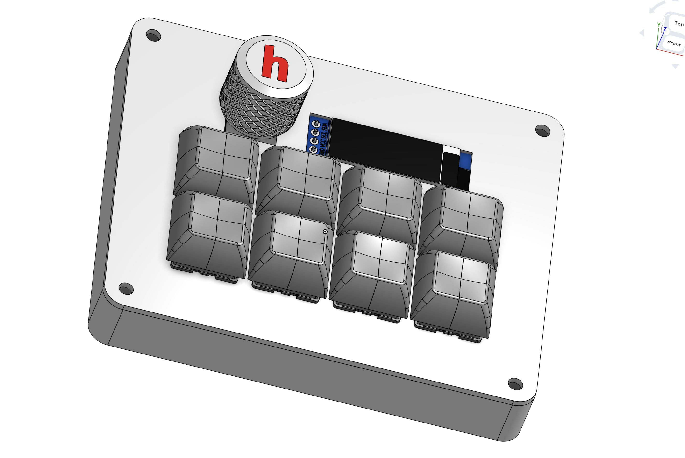
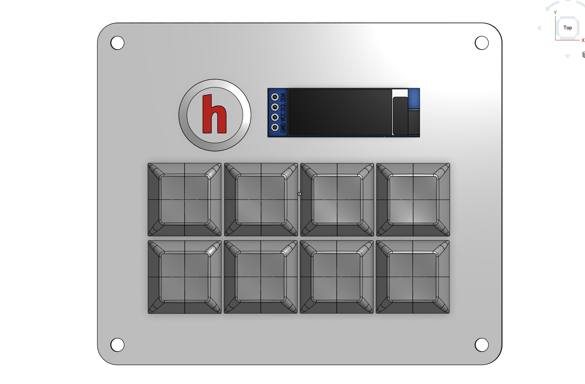
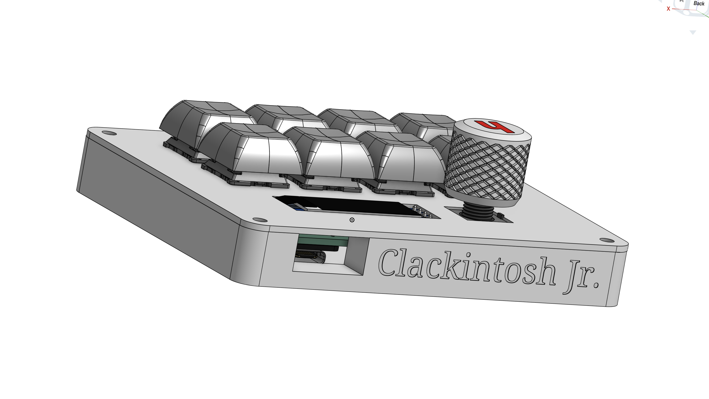
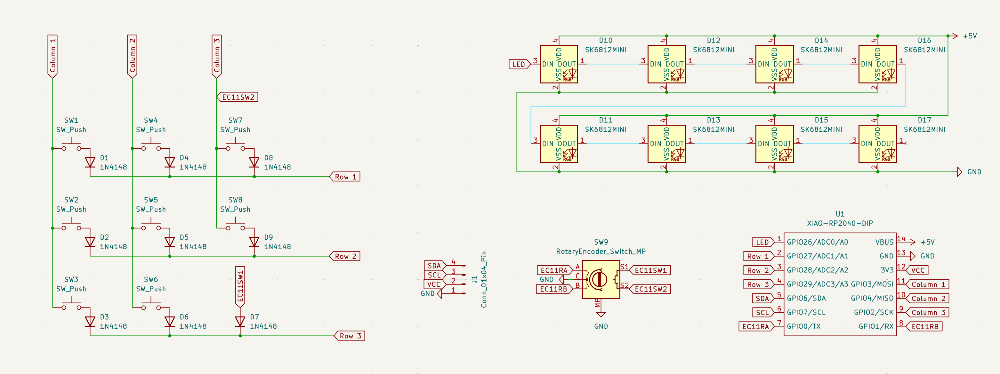
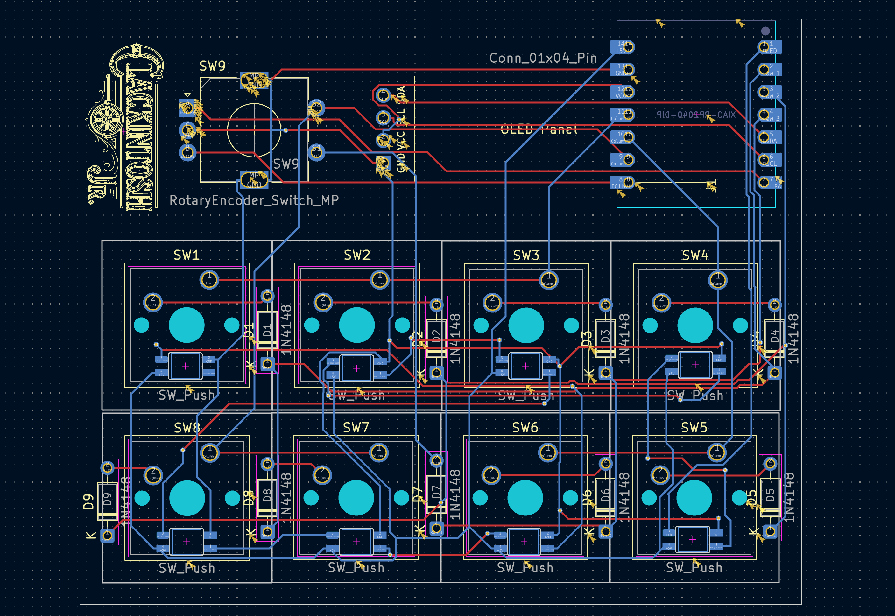
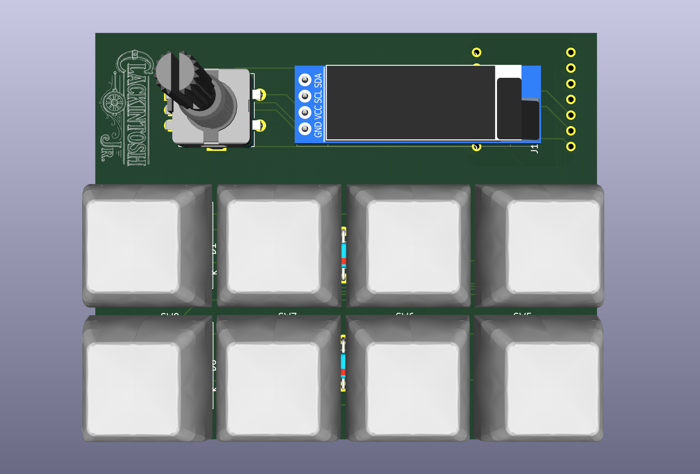
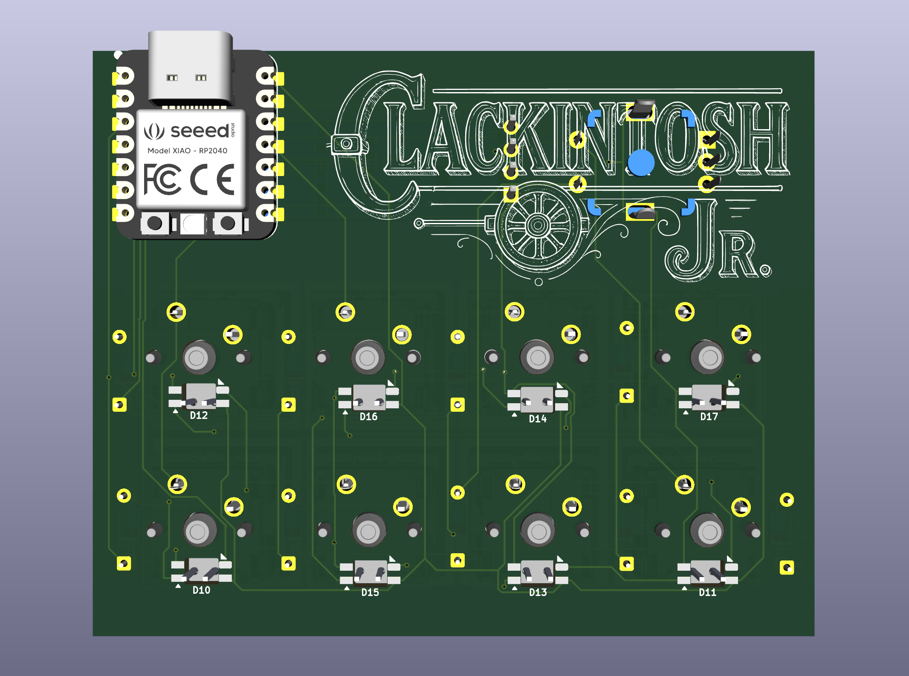

# Clackintosh Jr.
A macropad to accompany my mac and my keyboard 'Clackintosh'

## Features
- 8 mechanical keys
- Rotary encoder for volume up/down _ its switch as mute button
- 0.91" SSD1306 OLED display
- per-key RGB light
- Xiao RP2040 and KMK firmware

Each key launches a different app on macOS, the rotary encoder controls volume, and the OLED provides live feedback.

## Screenshots

## BOM

| Item                               | Qty |
|------------------------------------|-----|
| Seeed Xiao RP2040                  | 1   |
| Mechanical switches                | 8   |
| Keycaps                            | 8   |
| EC11Rotary Encoder                 | 1   |
| 0.91" OLED display                 | 1   |
| Diodes (for matrix)                | 9   |
| PCB                                | 1   |
| 3D printed case (top + bottom)     | 1   |
| Screws (case)                      | 4   |
